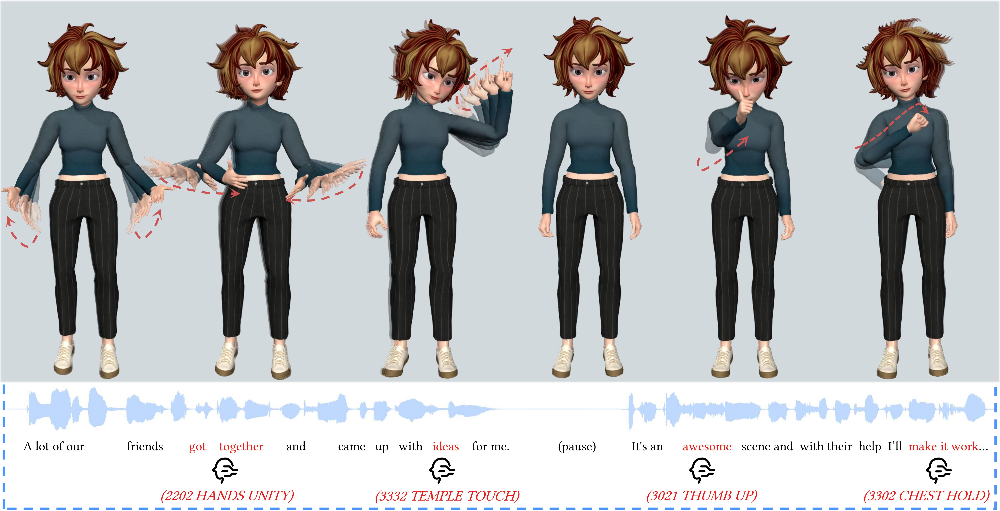
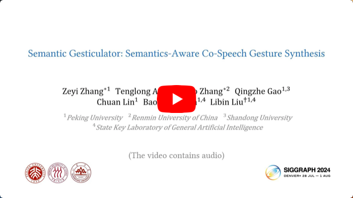
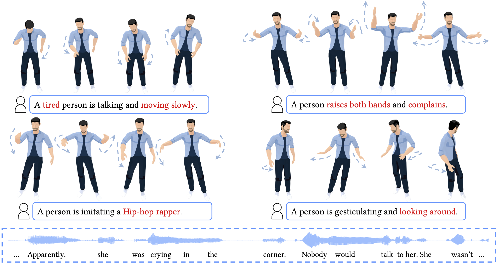
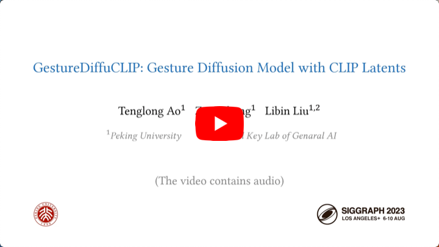
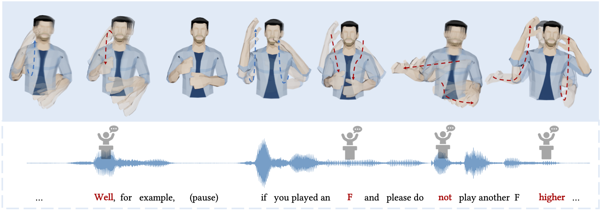
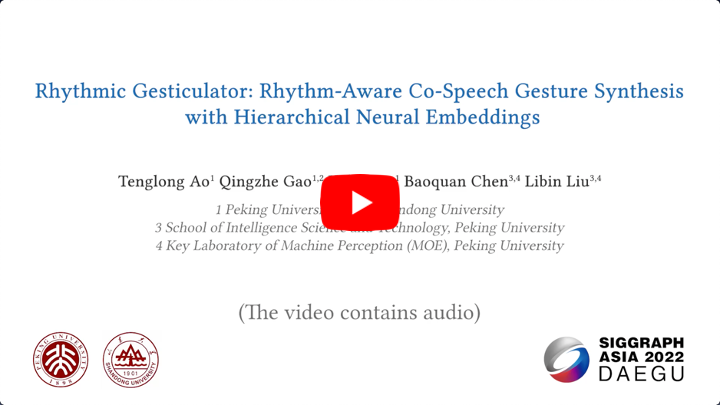

Human Behavior Animation
============

This project explores the human behavior animation, including gesture, etc., as part of my graduate research at Peking University, supervised by <a href="http://libliu.info/">Libin Liu</a>.

------------
**SIGGRAPH 2024**  
**Semantic Gesticulator: Semantics-aware Co-speech Gesture Synthesis** 

<a href="https://lumen-ze.github.io/">Zeyi Zhang*</a>,
<a href="https://aubrey-ao.github.io/">Tenglong Ao*</a>,
Yuyao Zhang*,
<a href="https://talegqz.github.io/">Qingzhe Gao</a>,
Chuan Lin,
<a href="http://baoquanchen.info/">Baoquan Chen</a>,
<a href="http://libliu.info/">Libin Liu</a>,
ACM Trans. Graph. 43, 4, Article 136.

------------

In this work, we present Semantic Gesticulator, a novel framework designed to synthesize realistic gestures accompanying speech with strong semantic correspondence. Semantically meaningful gestures are crucial for effective non-verbal communication, but such gestures often fall within the long tail of the distribution of natural human motion. The sparsity of these movements makes it challenging for deep learning-based systems, trained on moderately sized datasets, to capture the relationship between the movements and the corresponding speech semantics. To address this challenge, we develop a generative retrieval framework based on a large language model. This framework efficiently retrieves suitable semantic gesture candidates from a motion library in response to the input speech. To construct this motion library, we summarize a comprehensive list of commonly used semantic gestures based on findings in linguistics, and we collect a high-quality motion dataset encompassing both body and hand movements. We also design a novel GPT-based model with strong generalization capabilities to audio, capable of generating high-quality gestures that match the rhythm of speech. Furthermore, we propose a semantic alignment mechanism to efficiently align the retrieved semantic gestures with the GPT's output, ensuring the naturalness of the final animation. Our system demonstrates robustness in generating gestures that are rhythmically coherent and semantically explicit.

-
Video (<a href="https://www.youtube.com/watch?v=gKGqCE7id4U">YouTube</a>)
-
Paper (<a href="https://arxiv.org/abs/2405.09814">arXiv</a>)
-
Project Page (<a href="https://pku-mocca.github.io/Semantic-Gesticulator-Page">github</a>)
-
Code (<a href="https://github.com/LuMen-ze/Semantic-Gesticulator-Official/tree/f18aa1f3cebc0db7cf8fc2273b42c8a8b938b618">github</a>)
-
Dataset (<a href="https://github.com/LuMen-ze/Semantic-Gesticulator-Official/tree/f18aa1f3cebc0db7cf8fc2273b42c8a8b938b618">github</a>)
-

------------
**SIGGRAPH 2023** ([Technical Best Paper Honorable Mention](https://blog.siggraph.org/2023/07/siggraph-2023-technical-papers-awards-best-papers-honorable-mentions-and-test-of-time.html/)) 
**GestureDiffuCLIP: Gesture Diffusion Model with CLIP Latents** 

<a href="https://aubrey-ao.github.io/">Tenglong Ao</a>,
<a href="https://lumen-ze.github.io/">Zeyi Zhang</a>,
<a href="http://libliu.info/">Libin Liu</a>,
ACM Trans. Graph. 42, 4, Article 40.

------------

The automatic generation of stylized co-speech gestures has recently received increasing attention. Previous systems typically allow style control via predefined text labels or example motion clips, which are often not flexible enough to convey user intent accurately. In this work, we present GestureDiffuCLIP, a neural network framework for synthesizing realistic, stylized co-speech gestures with flexible style control. We leverage the power of the large-scale Contrastive-Language-Image-Pre-training (CLIP) model and present a novel CLIP-guided mechanism that extracts efficient style representations from multiple input modalities, such as a piece of text, an example motion clip, or a video. Our system learns a latent diffusion model to generate high-quality gestures and infuses the CLIP representations of style into the generator via an adaptive instance normalization (AdaIN) layer. We further devise a gesture-transcript alignment mechanism that ensures a semantically correct gesture generation based on contrastive learning. Our system can also be extended to allow fine-grained style control of individual body parts. We demonstrate an extensive set of examples showing the flexibility and generalizability of our model to a variety of style descriptions.

-
Video (<a href="https://www.youtube.com/watch?v=513EONcXOck">YouTube</a> | <a href="https://www.bilibili.com/video/BV1mm4y1h7L3">Bilibili</a>)
-
Paper (<a href="https://arxiv.org/abs/2303.14613">arXiv</a>)
-
Project Page (<a href="https://pku-mocca.github.io/GestureDiffuCLIP-Page">github</a>)
-
 
-
Explained (<a href="https://dl.acm.org/action/downloadSupplement?doi=10.1145%2F3592097&file=papers_158_VOD.mp4">SIGGRAPH Presentation(English)</a> | <a href="https://zhuanlan.zhihu.com/p/670746694">知乎(Chinese)</a>)
-

------------
**SIGGRAPH Asia 2022** ([Technical Best Paper Award](https://sa2022.siggraph.org/en/attend/award-winners/)) 
**Rhythmic Gesticulator: Rhythm-Aware Co-Speech Gesture Synthesis with Hierarchical Neural Embeddings** 

<a href="https://aubrey-ao.github.io/">Tenglong Ao</a>,
<a href="https://talegqz.github.io/">Qingzhe Gao</a>,
<a href="https://thorin666.github.io/">Yuke Lou</a>,
<a href="http://baoquanchen.info/">Baoquan Chen</a>,
<a href="http://libliu.info/">Libin Liu</a>,
ACM Trans. Graph. 41, 6, Article 209.

------------

Automatic synthesis of realistic co-speech gestures is an increasingly important yet challenging task in artificial embodied agent creation. In this work, we present a novel co-speech gesture synthesis method that achieves convincing results both on the rhythm and semantics. For the rhythm, our system contains a robust rhythm-based segmentation pipeline to ensure the temporal coherence between the vocalization and gestures explicitly. For the gesture semantics, we devise a mechanism to effectively disentangle both low- and high-level neural embeddings of speech and motion based on linguistic theory. The high-level embedding corresponds to semantics, while the low-level embedding relates to subtle variations. Lastly, we build correspondence between the hierarchical embeddings of the speech and the motion, resulting in rhythm and semantics-aware gesture synthesis.

-
Video (<a href="https://www.youtube.com/watch?v=qy2MrNhsoIs/">YouTube</a> | <a href="https://www.bilibili.com/video/BV1G24y1d7Tt/">Bilibili</a>)
-
Paper (<a href="https://arxiv.org/abs/2210.01448/">arXiv</a>)
-
Code (<a href="https://github.com/Aubrey-ao/HumanBehaviorAnimation/tree/main/HumanBehaviorAnimation/RhythmicGesticulator/Simplified_Version">github</a>)
-
Dataset (<a href="https://github.com/Aubrey-ao/HumanBehaviorAnimation/tree/main/HumanBehaviorAnimation/RhythmicGesticulator/MOCCA_Gesture_Dataset/">github</a>)
-
 
-
Explained (<a href="https://www.youtube.com/watch?v=DO_W8plFWco/">YouTube(English)</a> | <a href="https://zhuanlan.zhihu.com/p/573998492/">知乎(Chinese)</a>)
-

Acknowledgement
============
The layout of this project is highly inspired by <a href="https://github.com/sebastianstarke/AI4Animation">AI4Animation</a> repo.

Copyright Information
============
This project is only for research or education purposes, and not freely available for commercial use or redistribution.
